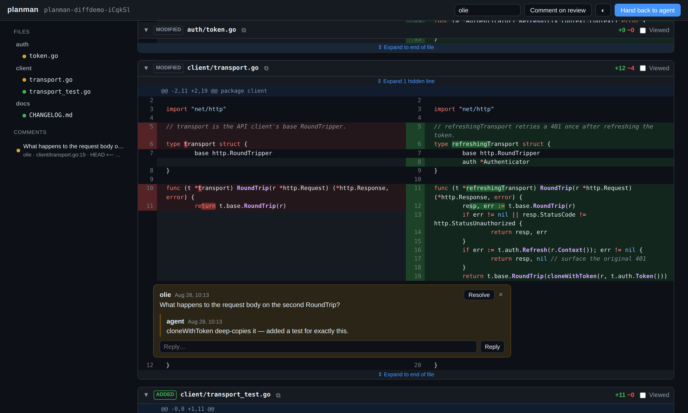
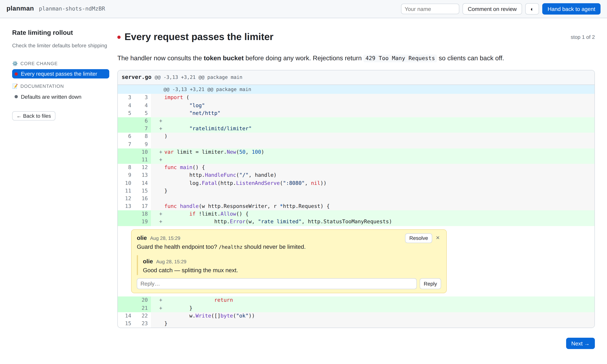

# planman

Reviews for coding agents. A self-contained, single-binary review tool
in Go, with two surfaces and one workflow:

- **`planman open plan.md`** reviews a markdown file the way
  [roughdraft](https://roughdraft.md) does: the rendered document opens
  in an always-on comment mode, and every comment lands *inside the
  markdown file* as [CriticMarkup](https://github.com/CriticMarkup/CriticMarkup-toolkit).
- **`planman diff`** is a GitHub-style "Files changed" review of a git
  repo's uncommitted or unpushed work, modeled on
  [prequel](https://github.com/mdesjardins/prequel): unified or split
  view, word-level diff highlighting, line and range comments, resolve
  and reopen. The keyboard navigation, find-in-diffs, definition jumps,
  and agent-authored walkthroughs are ideas taken from
  [codiff](https://github.com/nkzw-tech/codiff).

Either way the process blocks while you review. When you hit
**Hand back to agent** it exits and the agent picks up your comments.
No database, no cloud, no auth, no CDN.

```
┌──────────┐  planman open plan.md --json    ┌─────────┐
│  agent   │ ───────────────────────────────▶│ planman │──▶ browser review UI
│          │  planman diff --json            │  (Go)   │◀── comments
│          │ ◀─────────────────────────────── └─────────┘
└──────────┘   {"event":"handback", ...}
```







## Install

Grab a binary from [Releases](../../releases). Linux, macOS, and
Windows, amd64 and arm64. Everything ships inside the binary (htmx,
mermaid, styles), and it fetches nothing from the network at runtime.
Diff review shells out to your installed `git`.

Or build from source: `go build .`

## Usage

```
planman open <file.md> [flags]   Review a markdown file
planman diff [path]    [flags]   Review a repo's git diff

Shared flags:
  --json           Emit machine-readable JSON events on stdout
  --timeout DUR    Give up after DUR (default 30m)
  --port N         Listen on a fixed port (default: ephemeral)
  --no-browser     Don't open the browser automatically

Diff flags:
  --scope S        Initial range preset: working | staged | branch | all
  --base REF       Base ref override (default: origin default branch)
  --stay           Serve until interrupted instead of blocking on handback
```

Both commands block until one of:

| outcome     | exit code | JSON event                                        |
|-------------|-----------|---------------------------------------------------|
| handed back | 0         | `{"event":"handback","comments_open":2,...}`      |
| timeout     | 2         | `{"event":"timeout",...}`                         |
| interrupted | 130       | `{"event":"interrupted",...}`                     |

On start they print `{"event":"ready","url":"http://127.0.0.1:PORT"}`
(with `--json`) so callers can find the UI.

## Reviewing a diff

`planman diff` renders changes the way GitHub's PR review does: per-file
cards with add/delete stats, syntax-highlighted rows, word-level change
emphasis, and expandable hunk context. A file-tree sidebar shows status
dots and viewed checkmarks and jumps to files on click. Each card
collapses, and a toggle switches between unified and split view.

**Any two points compare.** The range chip in the toolbar opens a
history navigator, a commit graph with lanes, branch and tag pills, and
two pinned pseudo-endpoints for the working tree and the index. Click a
row to set the compare endpoint. Shift-click (or `b`) sets the base;
`j`/`k` move, `space` compares. The merge-base toggle diffs from the
merge-base of the two endpoints instead of the base itself, three-dot
style, and marks that commit in the graph. Preset chips cover the
common cases:

- Working tree: staged + unstaged + untracked vs `HEAD` (the default)
- Branch: commits vs the merge-base with the default branch
- All: everything since the merge-base, uncommitted work included

**All files.** The `all files` toggle lists every file at the head
endpoint in the sidebar, not just changed ones. Click an unchanged file
to open it in full as a reviewable card, comments included.

**Comments.** Hover a line, hit **+**, and comment on it, on either
side of the diff. Drag down the line-number gutter to comment on a
range of lines. Comment bodies render as markdown. Threads support
replies, resolve, reopen, and delete. Every thread records the
comparison it was made against, the selected refs plus the SHAs they
resolved to, and the comment stack in the sidebar lists all threads
with those references. Clicking one navigates the view back to that
comparison and scrolls to the thread, so you can show the agent exactly
what an earlier state got right. A thread made against the working tree
re-anchors into the current state instead, since an uncommitted
endpoint has no commit to return to.

**Toolbar extras.** Hide whitespace runs `git diff -w`. **Copy review**
puts every thread on the clipboard as markdown, ready to paste into a
chat. **Preview** on a markdown file shows the rendered document
instead of the patch. Changed images get before/after previews. The
sidebar resizes by its drag handle, and dragging it closed collapses
it.

**Keyboard.** `j`/`k` walk the hunks and `Enter` comments on the
current hunk's changed lines. `n`/`p` jump between files and `v` marks
the current file viewed. `Ctrl/⌘ F` searches every file in the diff,
cycles through matches, and dims files without one. `Ctrl/⌘ P`
fuzzy-filters files. `Ctrl/⌘ ⇧ P` opens a command palette. `Ctrl/⌘ B`
toggles the sidebar. Hold `?` for the full shortcut sheet. Hold
`Ctrl/⌘` and click an identifier to jump to its likely definition; a
bounded `git grep` plus per-language declaration matching finds it, no
language server needed.

The page follows the repository live over SSE. Comment activity from
other tabs or the agent refreshes silently. Edits to the repo itself
surface a refresh banner instead, so the diff never yanks around
mid-review, and a command-palette toggle restores instant reload if you
prefer it. When the diff shifts under a thread, the thread re-anchors
to its line's content.

**Walkthroughs.** An agent can post a narrative walkthrough of the
diff, chapters of stops that each explain a few hunks in markdown, via
the JSON API (`GET /api/hunks` for stable hunk ids, then
`POST /api/walkthrough`). A **Walkthrough** chip appears and the review
becomes a guided stepper with the agent's prose beside the live hunks.
Comments work inline, arrow keys move between stops, and the last stop
lists supporting changes plus a suggested commit message. If the diff
drifts, the tour flags itself outdated, and a stop whose hunk is gone
keeps its prose next to a placeholder. The bundled skill documents the
authoring flow.

Diff comments persist in `.git/planman/review.json`: per-repo,
invisible to your worktree, never committed. On handback planman also
writes `handback.json` and `handback.md` exports next to it, range
references included, and prints the path in the handback event.

## Agent workflow

**Blocking (agent-driven).** Tell your coding agent something like:

> After writing plan.md, run `planman open plan.md --json` and wait for
> it to exit. Then re-read plan.md. Review comments appear inline as
> `{>>comment<<}{id="..."}` markers next to the blocks they refer to.

or, for code:

> After making changes, run `planman diff --json` and wait for it to
> exit. The handback event names a JSON export listing every thread
> with its file, side, line, and anchored line text.

**Live loop (reviewer-driven).** Run `planman diff --stay` yourself. It
binds a port in 7350-7359 and serves until you stop it. Install the
bundled skill so Claude Code can find the server, work your comments
one at a time, resolve each as it goes, and reply in-thread where it
needs to explain a decision. The page updates live as it works:

```bash
mkdir -p ~/.claude/skills/planman
cp skills/planman/SKILL.md ~/.claude/skills/planman/
```

Then, from a Claude Code session in the repo under review: `/planman`.

The HTTP API behind that loop is plain JSON and works in both modes:

```
GET   /healthz                    → {"app":"planman","mode":"diff","root":...}
GET   /api/comments?status=open   → {"comments":[...]}
PATCH /api/comments/{id}          ← {"status":"resolved"}   (or "open")
POST  /api/comments/{id}/reply    ← {"author":"agent","text":"..."}
```

## What renders (markdown review)

- GitHub Flavored Markdown: tables, task lists, strikethrough, autolinks
- Syntax-highlighted code blocks (server-side via chroma, ~200 languages)
- Mermaid diagrams (embedded mermaid.js, rendered in the browser)
- Raw inline HTML

The whole UI, syntax highlighting included, follows your OS light/dark
preference. The topbar toggle or `?mode=light|dark` forces it.

### Editing

There is no WYSIWYG; edit the file in your normal editor. The **Open in
editor** button launches `$PLANMAN_EDITOR`, `$VISUAL`, or `$EDITOR`,
falling back to the OS default handler. The browser can't spawn a
terminal editor, so set a GUI editor like `code` for the button, or
just keep the file open in your editor already. The page live-reloads
on every save.

## Comment format (markdown review)

Hover any block, hit **+**, and write:


Block comments live in the file, next to their block:

```markdown
Some paragraph that got reviewed.

{>>this needs a source<<}{id="c1a2b"}
```

Thread metadata (page-level comments, authors, timestamps, replies, and
resolved status) lives in a YAML endmatter section wrapped in an HTML
comment, so ordinary renderers ignore it:

```markdown
<!-- planman:comments
comments:
    - id: c1a2b
      author: reviewer
      ts: 2026-08-03T12:00:00Z
      status: resolved
      replies:
        - author: agent
          ts: 2026-08-03T12:05:00Z
          text: fixed in the next revision
-->
```

Suggested edits are deliberately out of scope for now; CriticMarkup
already defines `{++add++}`, `{--del--}`, and `{~~old~>new~~}` for when
we want them.

## Security

No auth by design. planman binds to `127.0.0.1` only and is meant for
local use. It rejects requests whose `Host` is not loopback or whose
`Origin` is cross-site, which blocks DNS rebinding and CSRF, and it
serves everything with a same-origin Content-Security-Policy.

## Development

```sh
go test ./...        # unit tests (comment format, git diff engine, rendering, stores)
cd e2e && npm ci && npm test   # Playwright end-to-end tests (doc + diff flows)
```

The layout mirrors the domain. `internal/review` holds the shared
thread model and `Store` interface. `internal/critic` persists threads
inside markdown files and `internal/sidecar` in
`.git/planman/review.json`. `internal/gitdiff` drives git and parses
patches. `internal/server` is the mode-agnostic shell (routes, SSE,
security, agent API) over the `internal/docmode` and
`internal/diffmode` review modes.

Push a `v*` tag to cut a release. GitHub Actions runs GoReleaser,
builds all six platform binaries, and attaches them to the release.
