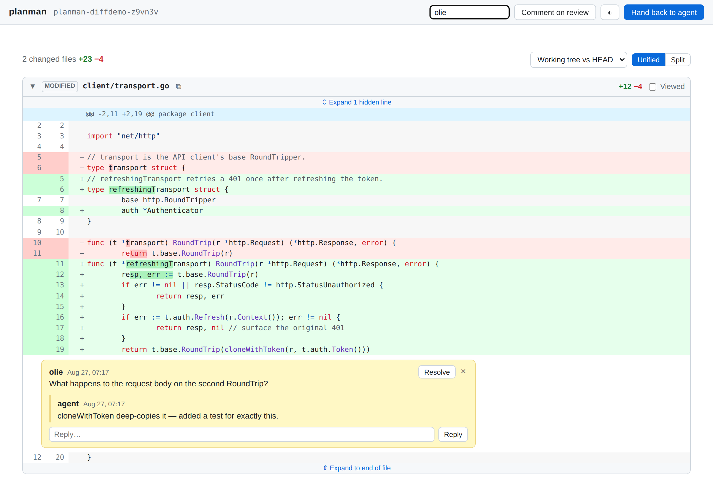
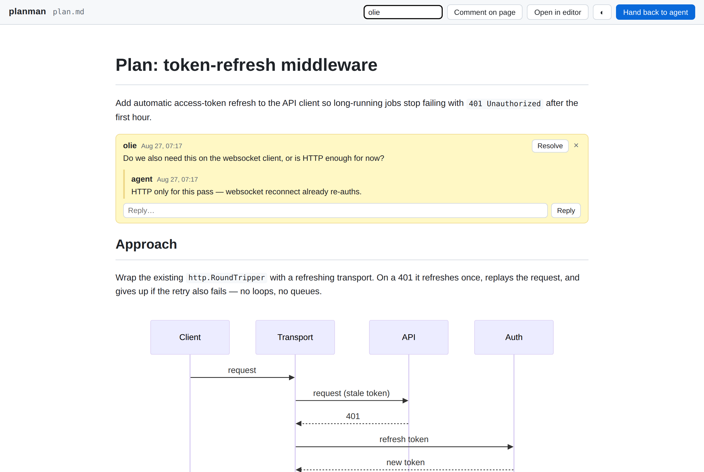
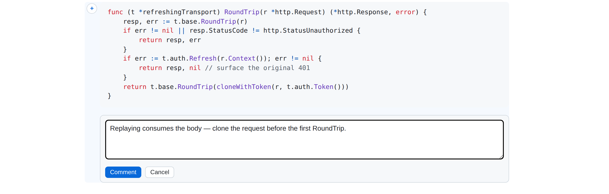

# planman

Reviews for coding agents — a self-contained, single-binary review tool
in Go. Two surfaces, one workflow:

- **`planman open plan.md`** — markdown review in the spirit of
  [roughdraft](https://roughdraft.md): the rendered document opens in an
  always-on comment mode, and every comment lands *inside the markdown
  file* as [CriticMarkup](https://github.com/CriticMarkup/CriticMarkup-toolkit).
- **`planman diff`** — a GitHub-style **Files changed** review of a git
  repo's uncommitted or unpushed work, in the spirit of
  [prequel](https://github.com/mdesjardins/prequel): unified or split
  view, word-level diff highlighting, line comments, resolve/reopen.

Either way the process **blocks** while you review; when you hit
**Hand back to agent** it exits and the agent picks up your comments.
No database, no cloud, no auth, no CDN.

```
┌──────────┐  planman open plan.md --json    ┌─────────┐
│  agent   │ ───────────────────────────────▶│ planman │──▶ browser review UI
│          │  planman diff --json            │  (Go)   │◀── comments
│          │ ◀─────────────────────────────── └─────────┘
└──────────┘   {"event":"handback", ...}
```





## Install

Grab a binary from [Releases](../../releases) — Linux, macOS, and Windows,
amd64 and arm64. It is fully self-contained (htmx, mermaid, styles are
embedded); nothing is fetched from the network at runtime. Diff review
shells out to your installed `git`.

Or build from source: `go build .`

## Usage

```
planman open <file.md> [flags]   Review a markdown file
planman diff [path]    [flags]   Review a repo's git diff

Shared flags:
  --json           Emit machine-readable JSON events on stdout
  --timeout DUR    Give up after DUR (default 30m)
  --port N         Listen on a fixed port (default: ephemeral)
  --no-browser     Don't open the browser automatically

Diff flags:
  --scope S        working | branch | all (default working)
  --base REF       Base ref for branch/all scopes (default: origin default branch)
  --stay           Serve until interrupted instead of blocking on handback
```

Both commands **block** until one of:

| outcome     | exit code | JSON event                                        |
|-------------|-----------|---------------------------------------------------|
| handed back | 0         | `{"event":"handback","comments_open":2,...}`      |
| timeout     | 2         | `{"event":"timeout",...}`                         |
| interrupted | 130       | `{"event":"interrupted",...}`                     |

On start they print `{"event":"ready","url":"http://127.0.0.1:PORT"}`
(with `--json`) so callers can find the UI.

## Reviewing a diff

`planman diff` renders the changes the way GitHub's PR review does:
per-file cards with add/delete stats, syntax-highlighted rows,
word-level change emphasis, expandable hunk context, collapse and
**Viewed** checkboxes, and a unified/split toggle. Three scopes cover
the pre-PR lifecycle:

- **working** — staged + unstaged + untracked vs `HEAD` (default)
- **branch** — commits vs the merge-base with `--base`
- **all** — everything since the merge-base, including uncommitted work

Hover a line, hit **+**, and comment on it (either side of the diff).
Threads support replies, resolve/reopen, and delete. The page follows
the repository live: edit, stage, or commit and the diff refreshes over
SSE — comment threads re-anchor to their line's content when the diff
shifts underneath them.

Diff comments persist in `.git/planman/review.json` — per-repo,
invisible to your worktree, never committed. On handback, planman also
writes `handback.json` and `handback.md` exports next to it and prints
the path in the handback event.

## Agent workflow

**Blocking (agent-driven).** Tell your coding agent something like:

> After writing plan.md, run `planman open plan.md --json` and wait for
> it to exit. Then re-read plan.md — review comments appear inline as
> `{>>comment<<}{id="..."}` markers next to the blocks they refer to.

or, for code:

> After making changes, run `planman diff --json` and wait for it to
> exit. The handback event names a JSON export listing every thread
> with its file, side, line, and anchored line text.

**Live loop (reviewer-driven).** Run `planman diff --stay` yourself —
it binds a port in 7350-7359 and serves until you stop it. Install the
bundled skill so Claude Code can find the server, work your comments
one at a time, resolve each as it goes, and reply in-thread where it
needs to explain a decision — the page updates live as it works:

```bash
mkdir -p ~/.claude/skills/planman
cp skills/planman/SKILL.md ~/.claude/skills/planman/
```

Then, from a Claude Code session in the repo under review: `/planman`.

The HTTP API behind that loop is plain JSON and works in both modes:

```
GET   /healthz                    → {"app":"planman","mode":"diff","root":...}
GET   /api/comments?status=open   → {"comments":[...]}
PATCH /api/comments/{id}          ← {"status":"resolved"}   (or "open")
POST  /api/comments/{id}/reply    ← {"author":"agent","text":"..."}
```

## What renders (markdown review)

- GitHub Flavored Markdown: tables, task lists, strikethrough, autolinks
- Syntax-highlighted code blocks (server-side via chroma — ~200 languages)
- Mermaid diagrams (embedded mermaid.js, rendered in the browser)
- Raw inline HTML

The whole UI — both modes, syntax highlighting included — follows your
OS light/dark preference; the topbar toggle or `?mode=light|dark`
forces it.

### Editing

There is no WYSIWYG — edit the file in your normal editor. The **Open in
editor** button launches `$PLANMAN_EDITOR`, `$VISUAL`, or `$EDITOR` (falling
back to the OS default handler). Terminal editors can't be spawned from the
browser; set a GUI editor like `code` for the button, or just have the file
open in your editor already. The page live-reloads on every save.

## Comment format (markdown review)

Hover any block, hit **+**, and write:



Block comments live in the file, next to their block:

```markdown
Some paragraph that got reviewed.

{>>this needs a source<<}{id="c1a2b"}
```

Thread metadata (page-level comments, authors, timestamps, replies, and
resolved status) lives in a YAML endmatter section wrapped in an HTML
comment, so ordinary renderers ignore it:

```markdown
<!-- planman:comments
comments:
    - id: c1a2b
      author: reviewer
      ts: 2026-08-03T12:00:00Z
      status: resolved
      replies:
        - author: agent
          ts: 2026-08-03T12:05:00Z
          text: fixed in the next revision
-->
```

Suggested edits are deliberately out of scope for now; CriticMarkup already
defines `{++add++}`, `{--del--}`, and `{~~old~>new~~}` for when we want them.

## Security posture

No auth by design — planman binds to `127.0.0.1` only and is meant for local
use. It rejects requests with non-loopback `Host` or cross-origin `Origin`
headers (DNS-rebinding/CSRF hardening) and serves everything with a
same-origin Content-Security-Policy.

## Development

```sh
go test ./...        # unit tests (comment format, git diff engine, rendering, stores)
cd e2e && npm ci && npm test   # Playwright end-to-end tests (doc + diff flows)
```

The layout mirrors the domain: `internal/review` is the shared thread
model and `Store` interface, persisted by `internal/critic` (inside
markdown files) and `internal/sidecar` (`.git/planman/review.json`);
`internal/gitdiff` drives git and parses patches; `internal/server` is
the mode-agnostic shell (routes, SSE, security, agent API) over the
`internal/docmode` and `internal/diffmode` surfaces.

Releases are cut by pushing a `v*` tag; GitHub Actions runs GoReleaser to
build all six platform binaries and attach them to the release.
